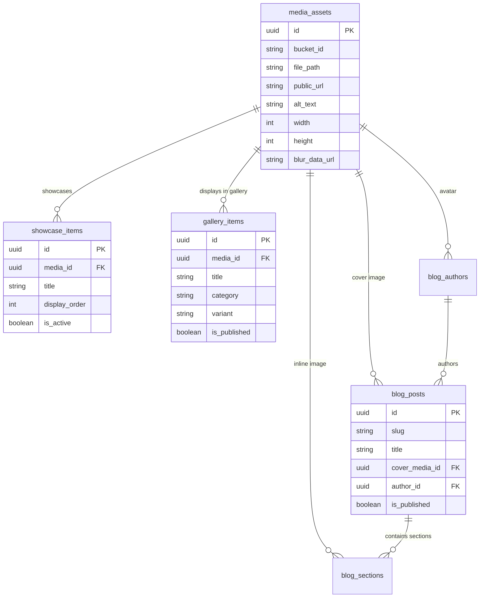

# ASTRELL — Database & Storage Architecture Recommendations

**Project:** ASTRELL Creative Agency Portfolio  
**Author:** AI Architecture Team  
**Date:** August 2026  
**Status:** Recommended Design  

---

## 1. Architectural Strategy: Multi-Bucket vs. Single Bucket

### **Recommendation: Multi-Bucket Architecture**

Rather than placing all files into a single monolithic bucket, ASTRELL should adopt a **Multi-Bucket Architecture** with structured storage rules.

| Architecture | Pros | Cons | Decision |
| :--- | :--- | :--- | :--- |
| **Single Bucket with Folders** | • Single endpoint setup | • Blanket security policies<br>• Mixed file-size and MIME type restrictions<br>• Slower path query indexing at scale | ❌ Not Recommended |
| **Multi-Bucket Architecture** | • Isolated bucket-level RLS policies<br>• Dedicated file size & MIME constraints per bucket<br>• Customized CDN Cache-Control headers<br>• High scalability without index contention | ✅ **RECOMMENDED** |

### **Why Multi-Bucket is Superior for ASTRELL:**
1. **Targeted File Constraints:** Landing page 3D showcase items require higher dimension caps (e.g. Max 5MB WebP), while blog inline images need strict 2MB caps and author avatars need 500KB caps. Supabase Storage enforces `allowed_mime_types` and `file_size_limit` at the **bucket level**.
2. **Granular Security (RLS):** Bucket-level security policies prevent unauthorized writes or accidental overwrites between showcase items and client/blog uploads.
3. **Optimized CDN & Performance:** Allows customized `Cache-Control` settings per asset tier (e.g., 1-year immutable caching for static showcase assets vs. shorter TTLs for draft blog uploads).

---

## 2. Complete Bucket Structure

We recommend creating **4 dedicated public storage buckets** in Supabase:

```
astrell-storage/
├── 1. astrell-showcase-assets   (Landing Page 3D Showcase items)
├── 2. astrell-portfolio-gallery  (General Gallery & Project Case Studies)
├── 3. astrell-blog-content       (Blog Cover Images & Inline Article Media)
└── 4. astrell-system-assets      (Author Avatars, Client Logos, UI Assets)
```

### **Bucket Configurations & Constraints:**

| Bucket Name | Purpose | Max Size | Allowed MIME Types | Cache Control |
| :--- | :--- | :--- | :--- | :--- |
| `astrell-showcase-assets` | 3D Landing Showcase (20–30 items max) | 5 MB | `image/webp`, `image/avif`, `image/png`, `image/jpeg` | `public, max-age=31536000, immutable` |
| `astrell-portfolio-gallery` | Infinite Scroll & Portfolio Work | 8 MB | `image/webp`, `image/avif`, `image/png`, `image/jpeg`, `video/mp4` | `public, max-age=31536000, immutable` |
| `astrell-blog-content` | Blog Covers, Inline Sections & Bento Grids | 3 MB | `image/webp`, `image/avif`, `image/png`, `image/jpeg`, `image/svg+xml` | `public, max-age=2592000` |
| `astrell-system-assets` | Author Avatars, Client Logos, System Icons | 1 MB | `image/webp`, `image/png`, `image/svg+xml` | `public, max-age=31536000, immutable` |

---

## 3. Storage Separation & Isolation Matrix

Which image collections should be completely separate?

1. **Landing Page Showcase (`astrell-showcase-assets`) — SEPARATE**
   - **Reason:** Curated, performance-critical assets consumed directly by the 3D WebGL/Canvas gallery. Must be strictly controlled and lightweight.
2. **General Gallery (`astrell-portfolio-gallery`) — SEPARATE**
   - **Reason:** Large volume of creative work (posters, banners, packaging, motion graphics). Supports drag-and-drop infinite scroll and masonry views.
3. **Blog & Editorial Content (`astrell-blog-content`) — SEPARATE**
   - **Reason:** Associated with specific blog posts, sections, and SEO content. Often updated alongside blog CMS publishing workflows.
4. **Brand & Author System Assets (`astrell-system-assets`) — SEPARATE**
   - **Reason:** Reusable static brand assets (author photos, client logos, badge icons).

---

## 4. Complete Database Schema (SQL)

The schema uses PostgreSQL in Supabase, leveraging `uuid`, JSONB, Foreign Keys, Triggers, and Row Level Security (RLS).

### **SQL DDL Script:**

```sql
-- ============================================================================
-- ASTRELL — COMPLETE DATABASE SCHEMA
-- ============================================================================

-- 1. CENTRAL MEDIA ASSETS REGISTRY
CREATE TABLE media_assets (
  id UUID DEFAULT gen_random_uuid() PRIMARY KEY,
  bucket_id TEXT NOT NULL,
  file_path TEXT NOT NULL,
  public_url TEXT NOT NULL,
  alt_text TEXT NOT NULL,
  caption TEXT,
  mime_type TEXT NOT NULL,
  file_size_bytes BIGINT NOT NULL,
  width INT NOT NULL,
  height INT NOT NULL,
  aspect_ratio NUMERIC(5, 2) GENERATED ALWAYS AS (ROUND((width::numeric / NULLIF(height, 0)::numeric), 2)) STORED,
  blur_data_url TEXT, -- Base64 Blurhash / LQIP placeholder
  metadata JSONB DEFAULT '{}'::jsonb,
  created_by UUID REFERENCES auth.users(id) ON DELETE SET NULL,
  created_at TIMESTAMPTZ DEFAULT NOW() NOT NULL,
  updated_at TIMESTAMPTZ DEFAULT NOW() NOT NULL,
  CONSTRAINT unique_bucket_file UNIQUE (bucket_id, file_path)
);

-- 2. LANDING PAGE SHOWCASE TABLE (3D Carousel - Max 30 limit)
CREATE TABLE showcase_items (
  id UUID DEFAULT gen_random_uuid() PRIMARY KEY,
  media_id UUID NOT NULL REFERENCES media_assets(id) ON DELETE CASCADE,
  title TEXT NOT NULL,
  subtitle TEXT,
  tag TEXT DEFAULT 'FEATURED' NOT NULL,
  display_order INT NOT NULL,
  is_active BOOLEAN DEFAULT TRUE NOT NULL,
  created_at TIMESTAMPTZ DEFAULT NOW() NOT NULL,
  updated_at TIMESTAMPTZ DEFAULT NOW() NOT NULL,
  CONSTRAINT unique_showcase_display_order UNIQUE (display_order)
);

-- 3. GENERAL PORTFOLIO GALLERY TABLE
CREATE TABLE gallery_items (
  id UUID DEFAULT gen_random_uuid() PRIMARY KEY,
  media_id UUID NOT NULL REFERENCES media_assets(id) ON DELETE CASCADE,
  title TEXT NOT NULL,
  slug TEXT UNIQUE NOT NULL,
  category TEXT NOT NULL, -- e.g., 'Brand Identity', 'Packaging', 'Social Media', 'Posters'
  tags TEXT[] DEFAULT '{}'::text[] NOT NULL,
  variant TEXT CHECK (variant IN ('default', 'masonry', 'polaroid')) DEFAULT 'default' NOT NULL,
  display_order INT DEFAULT 0 NOT NULL,
  is_published BOOLEAN DEFAULT TRUE NOT NULL,
  client_name TEXT,
  project_year INT,
  created_at TIMESTAMPTZ DEFAULT NOW() NOT NULL,
  updated_at TIMESTAMPTZ DEFAULT NOW() NOT NULL
);

-- 4. AUTHORS TABLE
CREATE TABLE blog_authors (
  id UUID DEFAULT gen_random_uuid() PRIMARY KEY,
  name TEXT NOT NULL,
  role TEXT NOT NULL,
  avatar_media_id UUID REFERENCES media_assets(id) ON DELETE SET NULL,
  bio TEXT NOT NULL,
  twitter TEXT,
  linkedin TEXT,
  created_at TIMESTAMPTZ DEFAULT NOW() NOT NULL
);

-- 5. BLOG POSTS TABLE
CREATE TABLE blog_posts (
  id UUID DEFAULT gen_random_uuid() PRIMARY KEY,
  slug TEXT UNIQUE NOT NULL,
  title TEXT NOT NULL,
  subtitle TEXT,
  excerpt TEXT NOT NULL,
  category TEXT NOT NULL,
  service_pillar TEXT NOT NULL,
  journey_stage TEXT CHECK (journey_stage IN ('awareness', 'consideration', 'decision', 'retention')) NOT NULL,
  primary_keyword TEXT NOT NULL,
  secondary_keywords TEXT[] DEFAULT '{}'::text[],
  search_intent TEXT CHECK (search_intent IN ('informational', 'commercial', 'transactional')) NOT NULL,
  tags TEXT[] DEFAULT '{}'::text[],
  published_at TIMESTAMPTZ,
  read_time TEXT NOT NULL,
  word_count INT NOT NULL,
  featured BOOLEAN DEFAULT FALSE NOT NULL,
  trending BOOLEAN DEFAULT FALSE NOT NULL,
  popular BOOLEAN DEFAULT FALSE NOT NULL,
  cover_media_id UUID REFERENCES media_assets(id) ON DELETE SET NULL,
  author_id UUID REFERENCES blog_authors(id) ON DELETE SET NULL,
  seo_title TEXT NOT NULL,
  seo_description TEXT NOT NULL,
  seo_keywords TEXT[] DEFAULT '{}'::text[],
  key_takeaways TEXT[] DEFAULT '{}'::text[],
  faq_schema JSONB DEFAULT '[]'::jsonb,
  cta_type TEXT DEFAULT 'awareness',
  internal_links JSONB DEFAULT '[]'::jsonb,
  is_published BOOLEAN DEFAULT FALSE NOT NULL,
  created_at TIMESTAMPTZ DEFAULT NOW() NOT NULL,
  updated_at TIMESTAMPTZ DEFAULT NOW() NOT NULL
);

-- 6. BLOG SECTIONS (Inline Article Images & Content Blocks)
CREATE TABLE blog_sections (
  id UUID DEFAULT gen_random_uuid() PRIMARY KEY,
  post_id UUID NOT NULL REFERENCES blog_posts(id) ON DELETE CASCADE,
  section_order INT NOT NULL,
  heading TEXT NOT NULL,
  subheading TEXT,
  paragraphs TEXT[] DEFAULT '{}'::text[] NOT NULL,
  pull_quote JSONB,
  callout JSONB,
  code_snippet JSONB,
  comparison_table JSONB,
  timeline JSONB,
  bento_grid JSONB,
  image_media_id UUID REFERENCES media_assets(id) ON DELETE SET NULL,
  image_caption TEXT,
  created_at TIMESTAMPTZ DEFAULT NOW() NOT NULL,
  CONSTRAINT unique_post_section_order UNIQUE (post_id, section_order)
);

-- 7. COMPLIANCE AUDIT LOGS (Existing Legal Compliance Tables)
CREATE TABLE consent_logs (
  id UUID DEFAULT gen_random_uuid() PRIMARY KEY,
  categories JSONB NOT NULL,
  timestamp TIMESTAMPTZ NOT NULL,
  policy_version TEXT NOT NULL,
  created_at TIMESTAMPTZ DEFAULT NOW() NOT NULL
);

CREATE TABLE agreement_logs (
  id UUID DEFAULT gen_random_uuid() PRIMARY KEY,
  email TEXT NOT NULL,
  document_versions JSONB NOT NULL,
  agreed_at TIMESTAMPTZ NOT NULL,
  created_at TIMESTAMPTZ DEFAULT NOW() NOT NULL
);
```

---

## 5. Image Limit Enforcement Architecture (Database vs Application Logic)

### **Question:** Should showcase limits (e.g. max 30 landing showcase items) be enforced in DB or App logic?
### **Recommendation: Dual-Layer Defense (Both DB Trigger and Application Validation)**

#### **1. Database Layer (PostgreSQL Trigger — Unbreakable Guarantee)**
Enforcing limits at the database level guarantees that even if a developer bypasses API logic, uses Supabase Studio, or executes raw SQL, the 30-item limit will **never** be breached.

```sql
-- Trigger Function to Enforce Max 30 Active Showcase Items
CREATE OR REPLACE FUNCTION check_showcase_item_limit()
RETURNS TRIGGER AS $$
DECLARE
  active_count INT;
BEGIN
  IF NEW.is_active = TRUE THEN
    SELECT COUNT(*) INTO active_count 
    FROM showcase_items 
    WHERE is_active = TRUE AND id <> COALESCE(NEW.id, '00000000-0000-0000-0000-000000000000'::uuid);
    
    IF active_count >= 30 THEN
      RAISE EXCEPTION 'Showcase item limit reached. Maximum 30 active items permitted in the landing page showcase.'
        USING ERRCODE = 'EXCHECK';
    END IF;
  END IF;
  RETURN NEW;
END;
$$ LANGUAGE plpgsql;

CREATE TRIGGER enforce_showcase_limit
BEFORE INSERT OR UPDATE ON showcase_items
FOR EACH ROW
EXECUTE FUNCTION check_showcase_item_limit();
```

#### **2. Application / API Layer (Next.js Server Actions / API Route)**
Provides instant user feedback in the CMS admin panel before attempting a database insert.

```typescript
// Example Next.js Server Action
export async function addShowcaseItem(data: NewShowcaseItem) {
  const { count, error } = await supabase
    .from('showcase_items')
    .select('*', { count: 'exact', head: true })
    .eq('is_active', true);

  if (count && count >= 30) {
    return { success: false, message: 'Landing page showcase limit (30 items) has been reached.' };
  }

  // Proceed with upload & insert...
}
```

---

## 6. Security & Row Level Security (RLS) Policies

### **Database Tables RLS:**

```sql
-- Enable RLS on all tables
ALTER TABLE media_assets ENABLE ROW LEVEL SECURITY;
ALTER TABLE showcase_items ENABLE ROW LEVEL SECURITY;
ALTER TABLE gallery_items ENABLE ROW LEVEL SECURITY;
ALTER TABLE blog_authors ENABLE ROW LEVEL SECURITY;
ALTER TABLE blog_posts ENABLE ROW LEVEL SECURITY;
ALTER TABLE blog_sections ENABLE ROW LEVEL SECURITY;
ALTER TABLE consent_logs ENABLE ROW LEVEL SECURITY;
ALTER TABLE agreement_logs ENABLE ROW LEVEL SECURITY;

-- PUBLIC READ POLICIES (Allow all visitors to fetch published content)
CREATE POLICY "Public Read Media Assets" ON media_assets FOR SELECT USING (true);
CREATE POLICY "Public Read Active Showcase" ON showcase_items FOR SELECT USING (is_active = true);
CREATE POLICY "Public Read Published Gallery" ON gallery_items FOR SELECT USING (is_published = true);
CREATE POLICY "Public Read Authors" ON blog_authors FOR SELECT USING (true);
CREATE POLICY "Public Read Published Blog Posts" ON blog_posts FOR SELECT USING (is_published = true);
CREATE POLICY "Public Read Blog Sections" ON blog_sections FOR SELECT USING (true);

-- ADMIN WRITE POLICIES (Restricted to authenticated admin users)
CREATE POLICY "Admin Full Access Media Assets" ON media_assets FOR ALL TO authenticated USING (true) WITH CHECK (true);
CREATE POLICY "Admin Full Access Showcase" ON showcase_items FOR ALL TO authenticated USING (true) WITH CHECK (true);
CREATE POLICY "Admin Full Access Gallery" ON gallery_items FOR ALL TO authenticated USING (true) WITH CHECK (true);
CREATE POLICY "Admin Full Access Blog Posts" ON blog_posts FOR ALL TO authenticated USING (true) WITH CHECK (true);
CREATE POLICY "Admin Full Access Authors" ON blog_authors FOR ALL TO authenticated USING (true) WITH CHECK (true);

-- ANONYMOUS INSERT POLICIES FOR COMPLIANCE LOGS
CREATE POLICY "Allow anonymous consent inserts" ON consent_logs FOR INSERT TO anon WITH CHECK (true);
CREATE POLICY "Allow anonymous agreement inserts" ON agreement_logs FOR INSERT TO anon WITH CHECK (true);
```

### **Supabase Storage Bucket RLS Policies:**

```sql
-- Public Read Access for all storage buckets
CREATE POLICY "Public Access Showcase Storage" ON storage.objects 
  FOR SELECT USING (bucket_id = 'astrell-showcase-assets');

CREATE POLICY "Public Access Gallery Storage" ON storage.objects 
  FOR SELECT USING (bucket_id = 'astrell-portfolio-gallery');

CREATE POLICY "Public Access Blog Storage" ON storage.objects 
  FOR SELECT USING (bucket_id = 'astrell-blog-content');

CREATE POLICY "Public Access System Storage" ON storage.objects 
  FOR SELECT USING (bucket_id = 'astrell-system-assets');

-- Authenticated Admin Write Access for storage
CREATE POLICY "Admin Upload Access Storage" ON storage.objects 
  FOR INSERT TO authenticated WITH CHECK (bucket_id IN (
    'astrell-showcase-assets', 
    'astrell-portfolio-gallery', 
    'astrell-blog-content', 
    'astrell-system-assets'
  ));
```

---

## 7. Naming Conventions Standard

To ensure maintainability across Next.js, Supabase, and PostgreSQL:

1. **Storage Buckets:** `kebab-case` with explicit domain prefix  
   - Format: `astrell-[domain]-[purpose]`  
   - Examples: `astrell-showcase-assets`, `astrell-portfolio-gallery`, `astrell-blog-content`.

2. **Database Tables:** `snake_case` plural nouns  
   - Examples: `media_assets`, `showcase_items`, `gallery_items`, `blog_posts`, `blog_authors`.

3. **Database Columns:** `snake_case` singular nouns  
   - Primary Key: `id` (UUID)  
   - Foreign Keys: `[singular_table_name]_id` (e.g. `media_id`, `author_id`, `post_id`)  
   - Timestamps: `created_at`, `updated_at`, `published_at` (TIMESTAMPTZ)  
   - Booleans: `is_active`, `is_published`, `featured`

4. **Storage File Paths:** `snake_case` or `kebab-case` with auto-generated content hash or UUID prefix to prevent collisions  
   - Format: `[year]/[month]/[uuid_or_slug]-[filename].[ext]`  
   - Example: `2026/08/9b1deb4d-3d-cyberpunk-poster.webp`

---

## 8. Best Practices for Scalability, Performance & SEO

1. **Zero Cumulative Layout Shift (CLS):**
   - The `media_assets` table stores exact `width`, `height`, and `aspect_ratio`.
   - When fetching images in Next.js, pass `width` and `height` to `<Image>` to reserve layout dimensions before images finish loading.

2. **Blurhash / Low-Quality Image Placeholder (LQIP):**
   - Store base64 `blur_data_url` in `media_assets`.
   - Use Next.js `<Image placeholder="blur" blurDataURL={asset.blur_data_url} />` for smooth visual hydration.

3. **Automatic WebP/AVIF Conversion:**
   - Client-side or edge function optimization should convert heavy uploaded PNGs/JPEGs into WebP/AVIF before storing in Supabase buckets, cutting transfer sizes by up to 70%.

4. **Database Indexing:**
   - Index `gallery_items(category)`, `gallery_items(is_published, display_order)`, `blog_posts(slug)`, and `blog_posts(category, journey_stage)` to ensure sub-millisecond query response times.

---

## Summary Diagram


